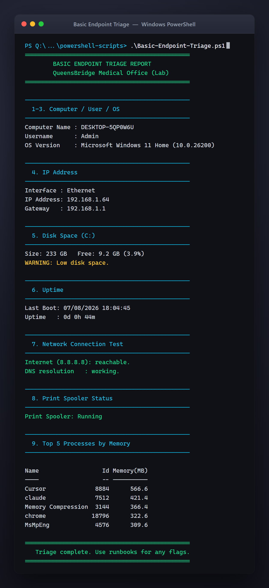
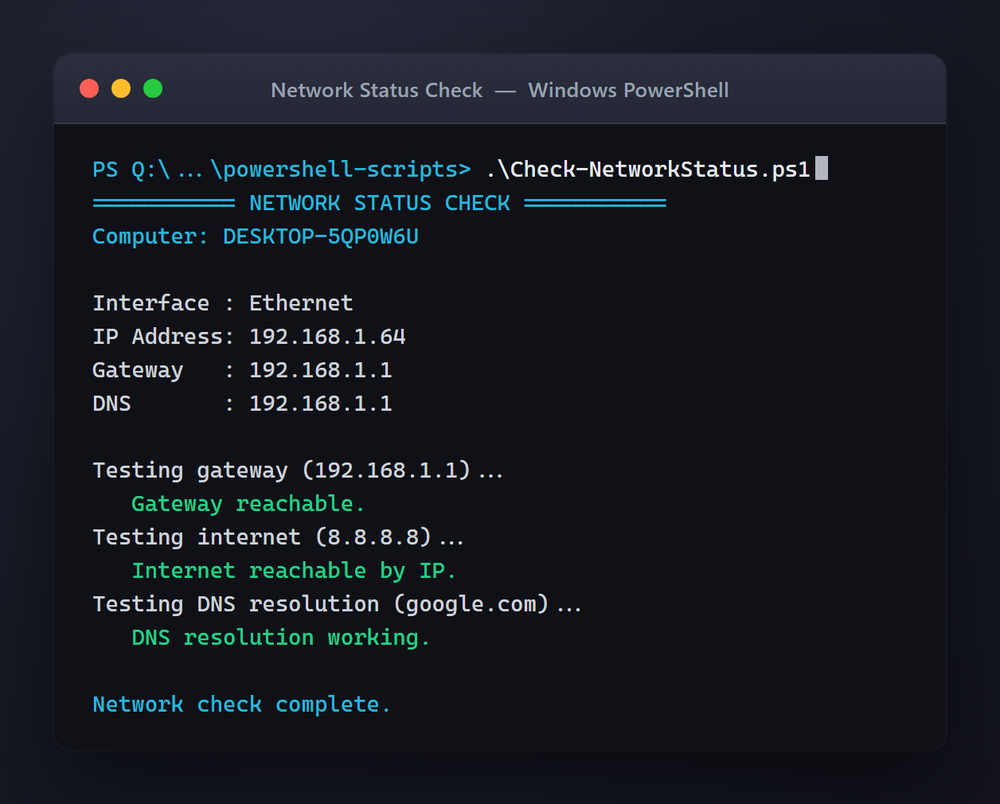
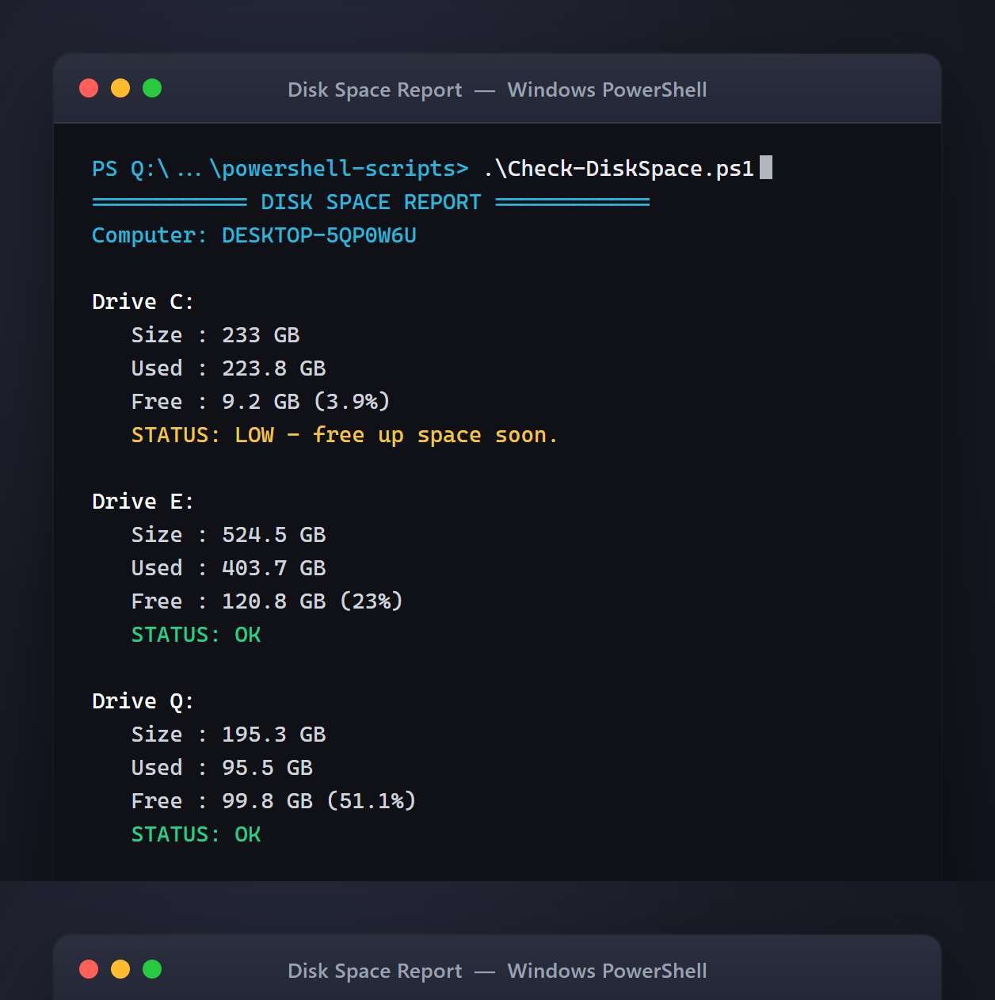
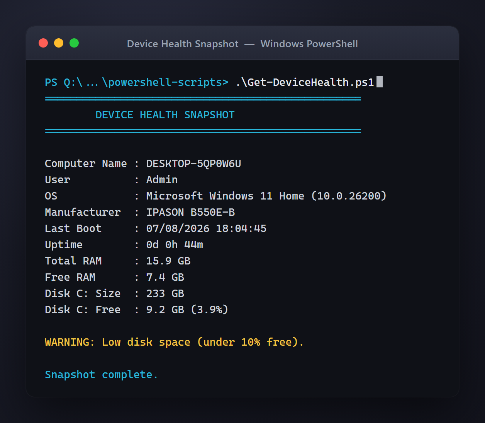
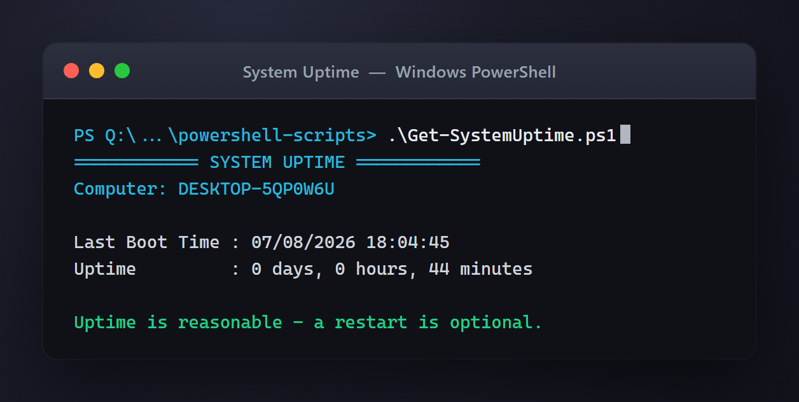

# Endpoint & Network Support Lab

A hands-on IT support lab that documents how a Level 1 technician troubleshoots Windows endpoints, small-office networking, printers, VPN, Wi-Fi, DNS, DHCP, and device inventory for a fictional company, **QueensBridge Medical Office**.

> This is a personal training / portfolio lab. It uses **no real company data, no real credentials, and no real personal information.** Everything is fictional and safe to share publicly.

  
   
  <em>Live output from <code>Basic-Endpoint-Triage.ps1</code> — one command, a full first-look snapshot of a device.</em>

---

## Project Summary

This project simulates the day-to-day work of an entry-level IT support technician. It includes:

- **20 troubleshooting runbooks** (network + endpoint) written the way a real service desk would document them
- **10 PowerShell scripts** for device health checks, disk space, network status, and inventory
- A **device asset inventory** tracker (CSV) with a written process guide
- **Mermaid diagrams** of the office network, support flow, and asset lifecycle
- **Sample script outputs** so reviewers can see results without running anything

The goal is to show that I can **diagnose common problems, use the right tools, document clearly, and know when to escalate** — the core skills of a help desk / desktop support role.

## Why This Project Matters for IT Jobs

Entry-level IT roles are judged on three things: **can you troubleshoot methodically, can you use the tools, and can you communicate clearly.** Certifications prove you studied; a lab like this proves you can actually *do the work*. Every runbook here follows the same structure a real ticketing system encourages: symptoms → diagnosis → commands → resolution → escalation → user-facing response.

## Skills Demonstrated

- Windows endpoint troubleshooting (performance, disk, updates, drivers, crashes)
- Network troubleshooting (DNS, DHCP, IP conflicts, gateway, VPN, Wi-Fi)
- Printer support (network + local)
- Command-line diagnostics (`ipconfig`, `ping`, `tracert`, `nslookup`, `netstat`)
- PowerShell scripting and automation
- IT asset inventory & lifecycle management
- Ticket documentation and escalation judgment
- Clear, non-technical user communication

## Tools & Concepts Used

| Category | Tools / Concepts |
|---|---|
| OS | Windows 10 / Windows 11 |
| Command line | `ipconfig`, `ping`, `tracert`, `nslookup`, `netstat` |
| PowerShell | `Test-NetConnection`, `Get-NetIPConfiguration`, `Get-CimInstance`, `Get-Process` |
| Networking | DNS, DHCP, gateway, subnet, VPN, Wi-Fi, shared folders (SMB) |
| Documentation | Markdown runbooks, CSV inventory, Mermaid diagrams |
| Support model | Level 1 first response + escalation to network/server teams |

## Lab Environment

The full fictional environment is documented in **[sample-data/lab-environment.md](sample-data/lab-environment.md)**.

Quick summary:

- **Company:** QueensBridge Medical Office (fictional)
- **15** Windows laptops, **3** printers, **1** office router
- **2** Wi-Fi networks: `Staff-WiFi` and `Guest-WiFi`
- **1** VPN connection for remote staff
- Shared folders for **HR, Finance, Operations, Management**
- **IT model:** Level 1 handles first response and escalates network/server issues

---

## Network Troubleshooting

Ten runbooks covering the most common small-office network tickets. See **[network-troubleshooting/](network-troubleshooting/)**.

| Runbook | Problem |
|---|---|
| [dns-not-resolving.md](network-troubleshooting/dns-not-resolving.md) | Names won't resolve, IPs work |
| [dhcp-issue.md](network-troubleshooting/dhcp-issue.md) | No / bad IP address from DHCP |
| [wifi-connected-no-internet.md](network-troubleshooting/wifi-connected-no-internet.md) | Connected to Wi-Fi but no internet |
| [printer-ip-changed.md](network-troubleshooting/printer-ip-changed.md) | Network printer stopped printing |
| [vpn-not-connecting.md](network-troubleshooting/vpn-not-connecting.md) | Remote VPN fails to connect |
| [shared-folder-unreachable.md](network-troubleshooting/shared-folder-unreachable.md) | Department share won't open |
| [slow-network.md](network-troubleshooting/slow-network.md) | Slow browsing / file transfers |
| [duplicate-ip-address.md](network-troubleshooting/duplicate-ip-address.md) | IP address conflict |
| [cannot-ping-gateway.md](network-troubleshooting/cannot-ping-gateway.md) | No local network / gateway |
| [website-access-issue.md](network-troubleshooting/website-access-issue.md) | One site won't load |

## Endpoint Troubleshooting

Ten runbooks covering common desktop-support tickets. See **[endpoint-troubleshooting/](endpoint-troubleshooting/)**.

| Runbook | Problem |
|---|---|
| [slow-laptop.md](endpoint-troubleshooting/slow-laptop.md) | Laptop running slowly |
| [low-disk-space.md](endpoint-troubleshooting/low-disk-space.md) | Disk almost full |
| [windows-update-stuck.md](endpoint-troubleshooting/windows-update-stuck.md) | Update stuck / failing |
| [printer-not-working.md](endpoint-troubleshooting/printer-not-working.md) | Can't print |
| [app-not-launching.md](endpoint-troubleshooting/app-not-launching.md) | Application won't open |
| [monitor-not-detected.md](endpoint-troubleshooting/monitor-not-detected.md) | External monitor not detected |
| [keyboard-mouse-issue.md](endpoint-troubleshooting/keyboard-mouse-issue.md) | Keyboard / mouse not working |
| [blue-screen-basic-triage.md](endpoint-troubleshooting/blue-screen-basic-triage.md) | Blue screen (BSOD) |
| [browser-crashing.md](endpoint-troubleshooting/browser-crashing.md) | Browser crashes / freezes |
| [software-install-request.md](endpoint-troubleshooting/software-install-request.md) | New software request |

## Asset Inventory

A working device tracker and the process behind it. See **[asset-inventory/](asset-inventory/)**.

- **[it-asset-inventory.csv](asset-inventory/it-asset-inventory.csv)** — 15 tracked devices with condition, security status, current issue, and ticket history
- **[asset-inventory-guide.md](asset-inventory/asset-inventory-guide.md)** — how IT tracks devices, updates the tracker, flags follow-ups, and handles onboarding/offboarding

## PowerShell Automation

Ten safe, beginner-friendly scripts. See **[powershell-scripts/](powershell-scripts/)**.

| Script | Purpose |
|---|---|
| [Get-DeviceHealth.ps1](powershell-scripts/Get-DeviceHealth.ps1) | One-page snapshot of a device |
| [Check-DiskSpace.ps1](powershell-scripts/Check-DiskSpace.ps1) | Report free/used disk space |
| [Check-NetworkStatus.ps1](powershell-scripts/Check-NetworkStatus.ps1) | IP, gateway, DNS, connectivity |
| [Export-DeviceInventory.ps1](powershell-scripts/Export-DeviceInventory.ps1) | Export device info to CSV |
| [Find-LargeFiles.ps1](powershell-scripts/Find-LargeFiles.ps1) | Find large files freeing disk space |
| [Restart-PrintSpooler.ps1](powershell-scripts/Restart-PrintSpooler.ps1) | Safely restart the print spooler |
| [Clear-TempFiles-Safe.ps1](powershell-scripts/Clear-TempFiles-Safe.ps1) | Clean temp files safely |
| [Get-StartupApps.ps1](powershell-scripts/Get-StartupApps.ps1) | List startup programs |
| [Get-SystemUptime.ps1](powershell-scripts/Get-SystemUptime.ps1) | Show last boot / uptime |
| [Basic-Endpoint-Triage.ps1](powershell-scripts/Basic-Endpoint-Triage.ps1) | Run all core checks at once |

Sample outputs are in **[sample-data/](sample-data/)** so you can see results without running anything.

## Diagrams

Mermaid diagrams (render on GitHub). See **[diagrams/](diagrams/)**.

- [small-office-network-diagram.md](diagrams/small-office-network-diagram.md) — router, Wi-Fi, laptops, printers, VPN, shares
- [endpoint-support-flow.md](diagrams/endpoint-support-flow.md) — ticket lifecycle
- [network-troubleshooting-flow.md](diagrams/network-troubleshooting-flow.md) — decision tree
- [asset-lifecycle-flow.md](diagrams/asset-lifecycle-flow.md) — procurement → offboarding

## Screenshots

Real output captured from the scripts running on a live Windows 11 machine. More captures are in **[screenshots/](screenshots/)**.

**Network status check** — IP, gateway, DNS, and connectivity in one pass:

  

**Disk space report** — every fixed drive, with low-space flags:

  

<table>
  <tr>
    <td align="center" width="50%">
       
      <em>Device health snapshot</em>
    </td>
    <td align="center" width="50%">
       
      <em>System uptime check</em>
    </td>
  </tr>
</table>

---

## Final Deliverables Checklist

- [x] Lab environment documented
- [x] 15-device asset inventory + process guide
- [x] 10 network troubleshooting runbooks
- [x] 10 endpoint troubleshooting runbooks
- [x] 10 PowerShell scripts (safe, commented)
- [x] 4 sample script outputs
- [x] 4 Mermaid diagrams
- [x] Screenshots of live script output
- [x] No real data, credentials, or personal information

## Roles This Project Targets

Desktop Support Technician (L1) · IT Support Specialist · Help Desk Technician · Service Desk Analyst I · Computer Support Analyst · IT Operations Support · Junior NOC / Support
