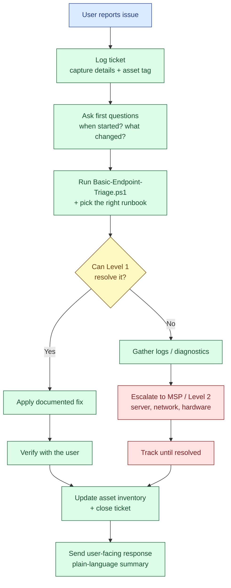

# Endpoint Support Flow

How a ticket moves through Level 1 support at QueensBridge Medical Office (fictional), from the user reporting an issue to resolution or escalation.

## Notes
- **Level 1** owns first response: triage, documented fixes, and user communication.
- **Escalation** goes to the MSP for servers, routers/switches, ISP, VPN server, and hardware repair.
- Every ticket ends with the **asset inventory updated** and a **plain-language response** to the user.
