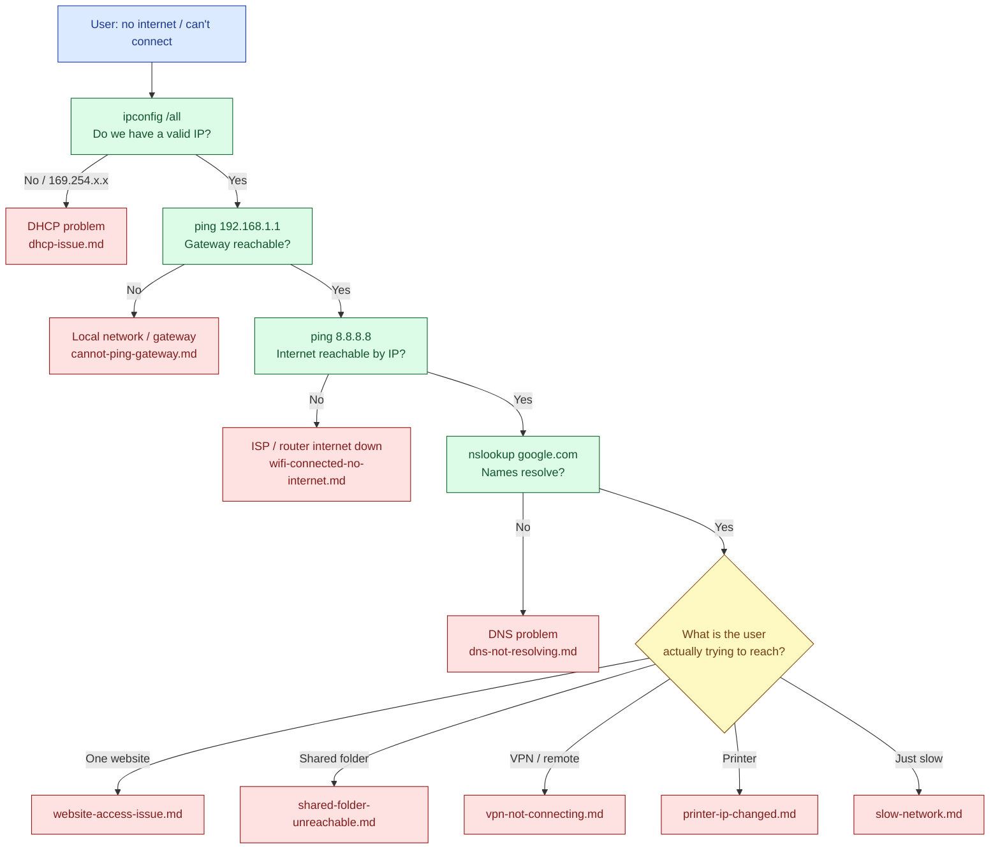

# Network Troubleshooting Flow

A decision tree for "no internet / can't reach something" tickets. It works outward from the laptop: IP → gateway → internet → DNS. The first failing step points to the right runbook.

## How to Use
1. Work **top to bottom** — don't skip steps. Each check narrows the cause.
2. The **first failing check** tells you which runbook to open.
3. If everything passes but a specific resource fails, jump to that resource's runbook.
4. Also see [duplicate-ip-address.md](../network-troubleshooting/duplicate-ip-address.md) if you see IP-conflict warnings.
