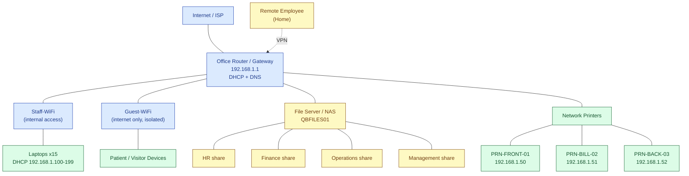

# Small Office Network Diagram

Logical layout of the QueensBridge Medical Office (fictional) network: internet → router → Wi-Fi and wired devices, printers, shared folders, plus a remote VPN user. IP examples match [../sample-data/lab-environment.md](../sample-data/lab-environment.md).

## Key Points
- **Router (192.168.1.1)** is the gateway, DHCP server, and DNS forwarder.
- **Staff-WiFi** reaches internal shares and printers; **Guest-WiFi** is internet-only and isolated.
- **Printers** use static IPs (`.50`–`.52`) so their addresses don't change.
- **Laptops** get DHCP addresses from `192.168.1.100`–`199`.
- **Shared folders** (HR, Finance, Operations, Management) live on `QBFILES01`.
- **Remote employees** reach internal resources over the **VPN** (dotted line).
